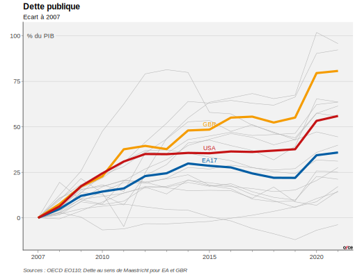

# package OFCE pour R

Ce package met à dispositon des outils utilisés régulièrement à l'OFCE, notamment les éléments pour produire avec ggplot2 les graphiques à la norme de la *Revue de l'OFCE.*

## Installation

Le package s'installe par:

``` r
devtools::install_github("OFCE/ofce")
```

## Utilisation

On utilise la fonction `theme_ofce()` pour appliquer le thème de la revue.

Par exemple, le code suivant télécharge des données du site de l'OCDE, prend le dernier *Economic Outlook* disponible, manipule les données pour les mettre dans le format souhaité, renomme les colonnes, calcule l'écart de dette puis enfin fabrique un graphique.

A ce graphique, on ajoute ensuite un logo (`add_logo_ofce()`) et un label des unités sur le plus grand des label de l'axe de y (`add_label_unit()`). On notera l'utilisation de `ggrepel` pour les labels de courbe et l'utilisation de `ggh4x` pour faire les marques mineures pour l'axe des x (avec l'instruction `guide="axis_minor"`).

``` r
library(OECD)
library(ggpmisc)
library(tidyverse)
library(lubridate)
library(countrycode)
library(ggrepel)
library(ggh4x)
library(glue)
library(tsibble)
library(ofce)

eoid <- OECD::get_datasets() |>
  filter(str_detect(id, "^EO")) |>
  mutate(eo = str_extract(id, "(?<=EO)[:digit:]+") |> as.numeric()) |>
  filter(eo == max(eo, na.rm=TRUE))
eo_ref <- str_c("EO", str_extract(eoid$id,"[:digit:]{3}"))
ez <- c('DEU', 'FRA', 'ITA', 'ESP', 'NLD', 'BEL', 'GRC', 'PRT', 'AUT',
        'FIN', 'SVK', 'IRL', 'LTU', 'SVN', 'LVA', 'EST', 'LUX', 'MLT') # 'CYP' is not in EO
query_A <- "EA17+GBR+USA+{str_c(ez[1:16], collapse='+')}.GNFLQ.A" |> glue()
oecd_raw <- OECD::get_dataset(dataset=eoid$id, query_A)
end_y <- max(as.numeric(oecd_raw$Time), na.rm=TRUE)-2
start_y <- 2007

oecd <- oecd_raw %>%
  mutate(year=as.numeric(Time),
         ObsValue = as.numeric(ObsValue)) %>%
  select(-UNIT,  -TIME_FORMAT, -FREQUENCY,-POWERCODE, pays=LOCATION, -Time) %>%
  pivot_wider(names_from=c(VARIABLE), values_from=ObsValue) %>%
  as_tsibble(key=pays, index=year) %>%
  group_by_key() %>%
  mutate(dette = if(all(is.na(GNFLQ))) GGFLMQ else GNFLQ, # si pas maastritcht, liabilities
         dette = dette-dette[which(year==2007)]) |> # calcul de l'écart
  mutate(pays = factor(pays, c(ez,"EA17","GBR","USA"))) # pour mettre dans l'ordre et couvrir les gris

breaks <- c(start_y, seq(2000,2030,5) ) |> sort() |> keep(~between(.x, start_y, end_y)) # manual breaks pour plus de finesse
colors <- c(set_names(rep("grey80", length(ez)), ez), set_names(ofce_palette(3), c("EA17","GBR","USA"))) # couleurs

dette <- (ggplot(oecd %>% filter(between(year,start_y,end_y)),
                 aes(x=year, y=dette, group=pays, color=pays))+
            geom_line(data= ~.x, #~filter(.x, pays%in%c("EA17","GBR","USA")) alternative
                      size=0.5)+
            geom_line(lwd=0.25, show.legend = FALSE)+
            geom_text_repel(data=~mutate(
              filter(.x,pays%in%c("EA17","GBR","USA")),
              label=if_else(pays%in%c("EA17","GBR","USA")&year==2015,
                            as.character(pays), "")),
              aes(label=label, color=label),
              size=3,force_pull = 0, nudge_y = 2.5,
              segment.size = 0.1, min.segment.length=0,
              show.legend = FALSE)+
            scale_color_manual(values = colors)+
            scale_x_continuous(name="", minor_breaks = seq(start_y, end_y, 1), breaks=breaks, guide="axis_minor")+
            scale_y_continuous(name="")+
            guides(color="none")+
            labs(title="Dette publique",
                 subtitle='Ecart à 2007',
                 caption=str_c(eo_ref, " Dette au sens de Maastricht pour EA et GBR")) +
            theme_ofce()) |>
  add_label_unit(ylabel="% du PIB") |>
  add_logo_ofce()

ggsave("work/dette.svg", dette, width=18, height=14, unit="cm")
```

Ce qui donne le résultat suivant :



## Licence

La licence est CECILL-B.
