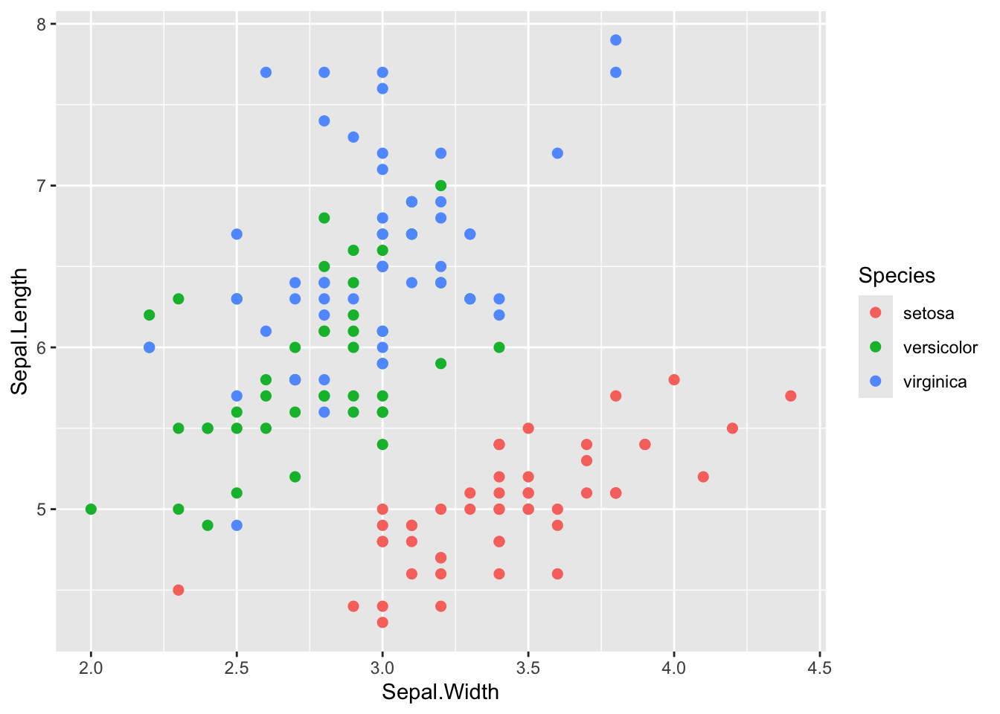
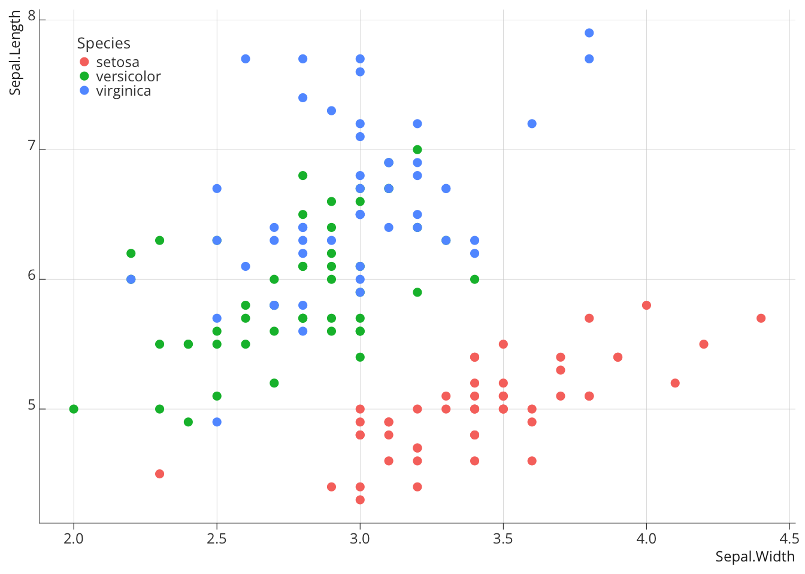
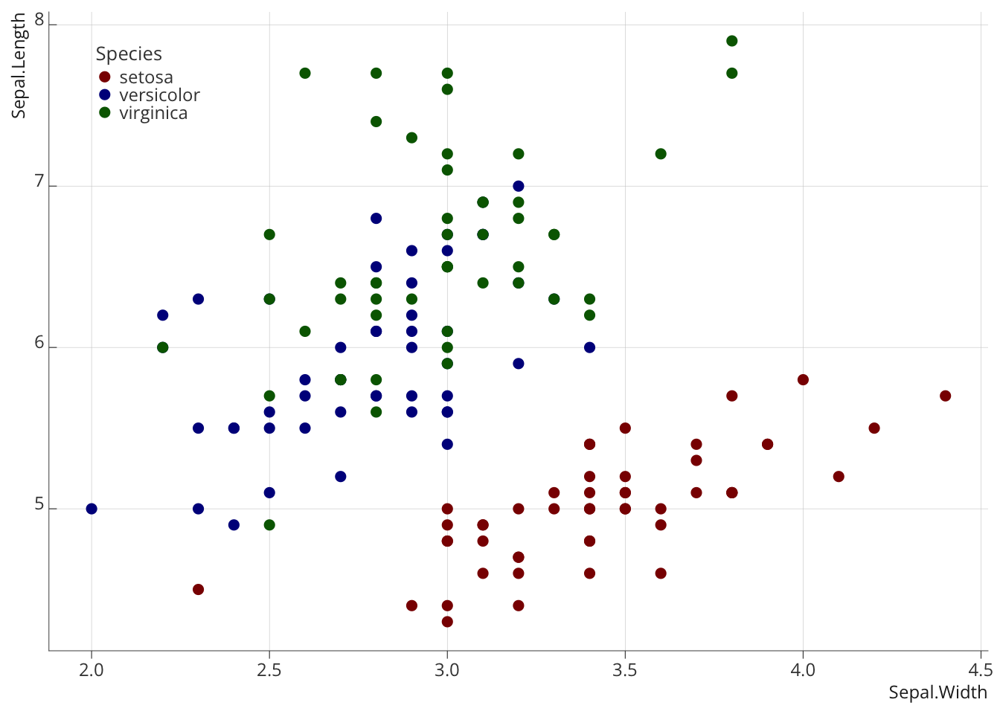
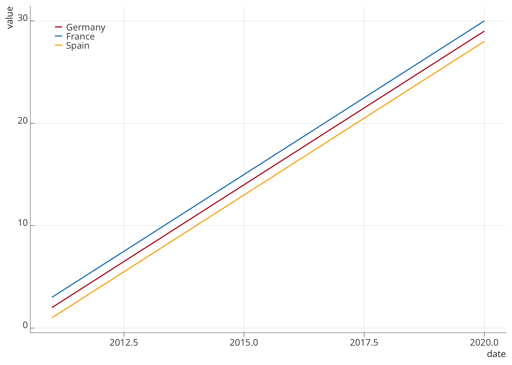

# Charte graphique

L’utilisation de `R` permet l’intégration directe de la charte graphique
de l’OFCE directement dans la rédaction du code, que ce soit pour la
production de graphiques, ou celle de tables. Cela passe par la
définition d’un thème qui en reprends les différents élements et qui est
ensuite associé à l’objet `ggplot2` ou `gt`.

## ggplot2

Un graphique ggplot2 par défaut aura le rendu suivant:

code

``` r
p <- ggplot(iris) + 
  aes(x = Sepal.Width, y = Sepal.Length, group = Species, color = Species) +
  geom_point(size = 2)

p
```



L’ajout de la commande `theme_XXX` permet d’appliquer un thème
spécifique au graphe produit (ici `theme_classic`). Plusieurs sont déjà
pré-enregistrés dans ggplot2.

code

``` r
p + theme_classic()
```


Un thème spécifique à l’OFCE existe dans le package ofce et permet
d’appliquer des modifications de forme qui reprenne les élements de la
charte graphique définie par ailleurs.

code

``` r
p + ofce::theme_ofce()
```



## Palettes de couleur

Il est également possible de spécifier manuellement les couleurs dans un
graphe à l’aide de la commande `scale_XXX_manual` [^1], en y associant
un vecteur de couleur.

code

``` r
p + 
ofce::theme_ofce() + 
  scale_color_manual(values = c("darkred", "darkblue", "darkgreen"))
```



Ou en reprenant la palette intégrée au package ofce qui intègre les
couleurs définies dans la charte graphique.

code

``` r
p + 
ofce::theme_ofce() + 
  scale_color_manual(values = ofce::ofce_palette(n=3))
```


Pour le choix des couleurs de pays, il est également possible de passer
par une fonction de type `scale_manual` dans le package `ofce`
`scale_color_pays` qui intègre directement l’application des codes
couleurs de la charte graphique en plus d’offrir des options
supplémentaires en termes de labelling.

Note: Il est essentiel à ce qu’il existe une colonne dans le dataframe
qui contiennent les codes pays au format [*ISO 3166-1
alpha-3*](https://www.iban.com/country-codes).

code

``` r
vec_iso <- c("ESP", "DEU", "FRA")
data <- data.frame("value" = c(1:30), 
                    "iso" = vec_iso) |> 
  arrange(iso) |> 
  mutate(date = c(2011:2020, 2011:2020, 2011:2020))
data |> 
  ggplot()  +
  geom_line(aes(x= date, y = value, color = iso )) +
  ofce::scale_color_pays(format = "iso3c",
                   lang = "en") +
  ofce::theme_ofce()
```



## Documentation Charte Graphique

Les références de code couleurs peuvent être consultés dans les
documents suivants:

### Pour les pays

### Pour les palettes principales

x

[^1]: selon le type de `geom` XXX sera soit un `color` (pour
    `geom_point` et `geom_line`) soit `fill` (pour les graphiques avec
    des zones à remplir comme `geom_area`).
