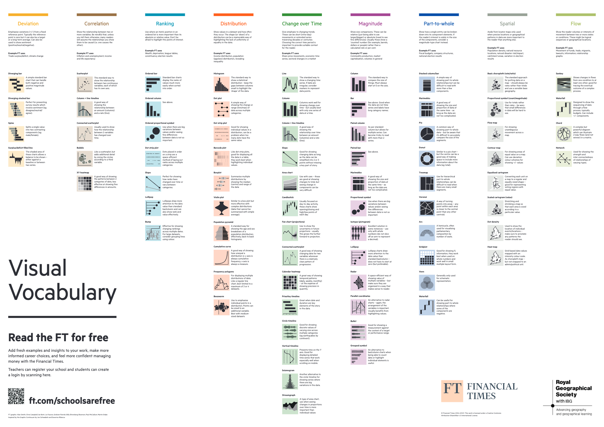

# Le language des graphiques

Faire un graphique ne s’improvise pas. Des années d’Excel donnent le
sentiment qu’un graphique, comme dit Mathieu Plane, “*c’est des données
et un click sur un bouton et voilà le graphique est fait*”.

Mais c’est plus riche et plus complexe que ça. Avec R, un graphique est
un peu plus qu’un click sur un bouton. Des possibilités sont ouvertes et
on s’apperçoit rapidement qu’on ne sait pas faire un graphique. Alors il
existe quelques ressources pour apprendre à mieux faire les graphiques.

Le site [data to viz](https://www.data-to-viz.com/) propose un arbre de
décision. C’est un premier pas vers une palette de graphiques un peu
plus riche que celle d’Excel.

Le FT a fait un travail comparable, à destination des écoles, afin
d’accroître le vocabulaire graphique :

## Quelques références pour aller plus loin

[Sémiologie graphique — Géoconfluences
(ens-lyon.fr)](https://geoconfluences.ens-lyon.fr/glossaire/semiologie-graphique#:~:text=La%20s%C3%A9miologie%20graphique%20est%20l,culturelles%2C%20symbolique%20du%20signe).)

[Guide de sémiologie graphique
(INSEE)](https://www.insee.fr/fr/statistiques/3640213)

et l’ensemble de l’oeuvre de Jacques Bertin, bien sûr.
