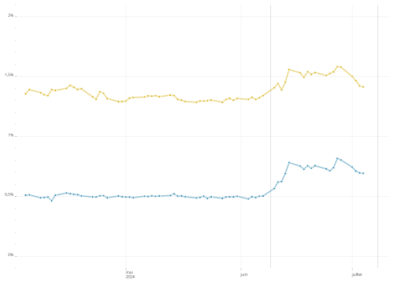

# Séries temporelles

## 5 Règles d’or

> **Règle 1** : On utilise [`theme_ofce()`](../reference/theme_ofce.md)
> pour les graphiques !

> **Règle 2** : Les dates sont au format `<date>` même lorsque la
> fréquence est annuelle.

> **Règle 3** : On utilise
> `scale_x_date(date_breaks = "5 years", date_minor_breaks = "1 year", guide = "minor_ticks")`
> en définissant `date_breaks` à la fréquence souhaitée (en évitant trop
> de dates) et `date_minor_breaks` à une année (`"1 year"`).

> **Règle 4** : Si les *y* sont en %, alors mettre “%” dans le format de
> l’axe des *y*.

> **Règle 5** : On choisit un `line_width` entre 0.5 et 1 pour le
> [`geom_line()`](https://ggplot2.tidyverse.org/reference/geom_path.html),
> on ajoute un `geom_point(shape=21, stroke=0.25, col="white")` pour
> marquer les points auxquels on a des données. Si on peut mettre la
> légende sous forme de *labels*, c’est mieux car cela allège le
> graphique.

## Les données

Pour les séries temporelles, il y a deux recommandations pour les
données :

1.  utilisez le format long pour les données du graphique. Il peut être
    plus simple pour calculer des taux de croissance ou des ratios de
    passer en format large, mais c’est mieux de passer en format long
    pour la partie graphique, avec une ou plusieurs colonnes pour
    différencier les lignes. Cela permettra d’associer une couleur à
    chaque série et une facette à chaque pays par exemple.

2.  le champ décrivant les dates doit être en type `date`. ce n’est pas
    toujours évident quand les séries sont à fréquence annuelle, mais
    c’est très utile pour mélanger des séries de fréquence irrégulière,
    pour homogénéiser l’aspect des axes de dates et mieux maîtriser le
    formatage des dates. Pour convertir une date en date, soit elle est
    au format `<character>` sous la forme `"2022-12-01"` et la fonction
    [`base::as.Date()`](https://rdrr.io/r/base/as.Date.html) fonctionne
    très bien. Sinon, pour les autres cas, le package
    [lubridate](https://lubridate.tidyverse.org) (formation R niv. 1)
    est très pratique et propose de nombreuses fonctions permettant
    d’absorber beaucoup de cas (les fonctions sont par exemple
    [`lubridate::ymd()`](https://lubridate.tidyverse.org/reference/ymd.html)
    [`lubridate::dmy()`](https://lubridate.tidyverse.org/reference/ymd.html)
    [`lubridate::my()`](https://lubridate.tidyverse.org/reference/ymd.html)
    etc…).

code

``` r

dates <- c(2023, 2024, 2025)
as.Date(as.character(dates), format  = "%Y")
```

    [1] "2023-06-03" "2024-06-03" "2025-06-03"

code

``` r

# si on veut préciser le jour et le mois de l'année
as.Date(str_c(dates, "-01-01"))
```

    [1] "2023-01-01" "2024-01-01" "2025-01-01"

code

``` r

dates <- c("1/2023", "2/2024", "3/2025")
lubridate::my(dates)
```

    [1] "2023-01-01" "2024-02-01" "2025-03-01"

> **Note**
>
> Dans le cas où les données proviennent d’Excel et sont en format
> numérique on peut utiliser `as.Date(df$date, origin = "1899-12-30")`
> pour les convertir en `<date>`.

Prenons l’exemple du graphiques sur les spreads ([legislatives2024, Blot
Geerolf
Plane](https://www.ofce-legislatives2024.fr/analyses/spreads.html#fig-spread)).
Les données sont générées par un scrapping sur *investing.com* (en
attendant une solution API sur une banque de données bien faite). Les
données se présentent sous la forme.

code

``` r

spreads
```

    # A tibble: 10.117 × 3
       date       pays        taux
       <date>     <chr>      <dbl>
     1 2007-01-02 spreadfra 0.0130
     2 2007-01-03 spreadfra 0.0360
     3 2007-01-04 spreadfra 0.0280
     4 2007-01-05 spreadfra 0.0190
     5 2007-01-08 spreadfra 0.0440
     6 2007-01-09 spreadfra 0.0430
     7 2007-01-10 spreadfra 0.0290
     8 2007-01-11 spreadfra 0.0370
     9 2007-01-12 spreadfra 0.0340
    10 2007-01-15 spreadfra 0.0380
    # ℹ 10.107 more rows

Les données sont au format long (avec deux modalités pour `pays` et donc
3 colonnes), les dates sont au format `<date>`, donc tout va presque
bien. La colonne `pays` est un peu brute. On la transforme pour avoir un
label plus propre et en facteur, pour contrôler l’ordre (on met France
en premier, Italie en second). Il y a plusieurs méthodes pour arriver à
ce résultat. Ici, on reste très simple parce qu’il n’y a que deux
modalités. Si il y en avait plus de deux (et surtout un grand nombre,
possiblement évolutif), on aurait fait quelques manipulations de chaînes
et on aurait utilisé le package
[countrycode](https://vincentarelbundock.github.io/countrycode/) pour
transformer les code pays en texte lisible, possiblement traduit dans
différentes langues.

code

``` r

spreads_data <- spreads |>
  distinct(date, pays, .keep_all = TRUE) |>
  mutate(pays = factor( pays, c("spreadfra", "spreadita"), c("France", "Italie")))
spreads
```

    # A tibble: 10.117 × 3
       date       pays        taux
       <date>     <chr>      <dbl>
     1 2007-01-02 spreadfra 0.0130
     2 2007-01-03 spreadfra 0.0360
     3 2007-01-04 spreadfra 0.0280
     4 2007-01-05 spreadfra 0.0190
     5 2007-01-08 spreadfra 0.0440
     6 2007-01-09 spreadfra 0.0430
     7 2007-01-10 spreadfra 0.0290
     8 2007-01-11 spreadfra 0.0370
     9 2007-01-12 spreadfra 0.0340
    10 2007-01-15 spreadfra 0.0380
    # ℹ 10.107 more rows

## La base du graphique

Le graphique de base est alors simple à construire. On utilise une
couche
[`geom_line()`](https://ggplot2.tidyverse.org/reference/geom_path.html)
et
[`geom_point()`](https://ggplot2.tidyverse.org/reference/geom_point.html),
une couche [`aes()`](https://ggplot2.tidyverse.org/reference/aes.html)
avec comme `x` les dates, `y` les taux et couleurs les pays. Pour
[`geom_line()`](https://ggplot2.tidyverse.org/reference/geom_path.html),
il faut préciser le groupe (cela peut paraître redondant, mais cela peut
servir si on veut colorer en fonction d’une autre variable). L’ordre est
important et le
[`geom_line()`](https://ggplot2.tidyverse.org/reference/geom_path.html)
est en premier et donc en dessous du
[`geom_point()`](https://ggplot2.tidyverse.org/reference/geom_point.html).

code

``` r

library(ofce)
cc <- PrettyCols::prettycols("Summer", n=2)
date_maj <- "2024-07-01"
main <- ggplot(spreads_data) +
  aes(x=date, y=taux, fill = pays, color=pays, group=pays) +
  geom_line(linewidth = 0.75, alpha = 0.5, show.legend = FALSE) +
  geom_point(stroke = 0.5, size = 1,
  col = "white", shape = 21, show.legend = FALSE)+
      scale_color_manual(
        aesthetics = c("fill", "color"),
        name = NULL, values = cc) +
  theme_ofce()+
  scale_ofce_date() + 
  guides(
      y = guide_axis(minor.ticks = TRUE)) +
  labs(
        y="Ecart de taux à 10 ans",
        x=NULL,
        colour=NULL,
        caption = glue::glue("*Source* : investing.com<br>Mis à jour : {date_maj}")) +
      scale_y_continuous(
        labels = ~str_c(.x, "%"),
        minor_breaks = scales::breaks_width(0.1))
  main |> add_logo()
```


On utilise la palette *summer* de
[PrettyCols](https://nrennie.rbind.io/PrettyCols/) (affaire de goût). On
utilise la fonction [`theme_ofce()`](../reference/theme_ofce.md) pour
homogénéiser la présentation des graphiques. On précise les labels des
axes inutile pour `x`, explicite pour `y`. Et la source, en notant que
l’on peut utiliser `markdown` dans le texte de la source, ce qui permet
de mettre *Source* en italique.

Le recours à
[`scale_x_date()`](https://ggplot2.tidyverse.org/reference/scale_date.html)
permet de spécifier facilement le format des dates (avec la syntaxe de
[`base::strptime()`](https://rdrr.io/r/base/strptime.html)) et la
fonction `scale::label_date_short()` permet un formatage élégant des
dates (voir plus bas la partie insert).

On ajoute au graphique des annotations. C’est ici faid de façon
laborieuse, on peut construire des fonctions (formation R niv. 2) ou
utiliser [esquisse](https://dreamrs.github.io/esquisse/) ou
`{gganotate}` mais ces deux solutions ont des défauts.

## Les annotations

Pour les annotations on peut utiliser différentes méthodes. La plus
laborieuse est la fonction
[`ggplot2::annotate()`](https://ggplot2.tidyverse.org/reference/annotate.html).
La plus élégante est `ggforce::geom_mark_circle()` ou
`ggrepel::geom_repel_text()`.

code

``` r

# méthode 1 : annotate

annotations <-  list(
  annotate(
    "text", x = as.Date("2013-12-01"), y= 1,
    label="France" , color=cc[[1]] , size=3, fontface ="bold"),
  annotate(
    "text", x = as.Date("2010-06-01"), y= 3 ,
    label="Italie" , color=cc[[2]], size=3, fontface ="bold"),
  annotate(
    "text",
    x = as.Date("2009-12-01"),
    y= 5 ,
    label="Crise des dettes souveraines\n26 juillet 2012 : Mario Draghi \n 'Whatever it takes'" ,
    color= "grey33",
    size=2,
    hjust=1),
  annotate(
    "segment",
    x = as.Date("2010-03-01"),
    xend = as.Date("2011-07-01"),
    y = 5,
    yend = 4.6,
    colour = "grey33",
    linewidth=0.25,
    arrow= arrow(length = unit(4, "point"))),
  annotate(
    "text",
        x = as.Date("2016-9-01"),
    y= 4.5 ,
    size = 2,
    label="4 mars 2018 : Élections italiennes\n1er juin : gouvernement de coalition" ,
    color= "grey33"),
  annotate(
    "segment",
    x = as.Date("2016-09-01"),
    xend = as.Date("2018-05-01"),
    y = 4.2,
    yend = 3,
    colour = "grey33",
    linewidth=0.25,
    arrow=arrow(length = unit(4, "point"))),
  annotate(
    "text",
    x = as.Date("2022-01-01"),
    hjust = 1,
    y= 0.8,
    label="Annonce de la dissolution" ,
    color= "grey33",
    size=2),
  annotate(
    "segment",
    x = as.Date("2022-03-01"),
    xend = as.Date("2024-04-01"),
    y = 0.8,
    yend = 0.7,
    colour = "grey33",
    linewidth=0.25,
    arrow= arrow(length = unit(4, "point"))))

(main + annotations) |> add_logo()
```


code

``` r

# méthode 2 : ggrepel
# on enrichit les données des labels,
# le code est plus compact et surtout plus facile à manier
# (pour modifier les annotations, on le fait dans les deux tribbles)

library(ggrepel)

events <- tribble(
  ~date, ~pays, ~event,
  "2012-01-02", "Italie", "Crise des dettes souveraines\n26 juillet 2012 : Mario Draghi \n 'Whatever it takes'",
  "2018-06-01", "Italie", "4 mars 2018 : Élections italiennes\n1er juin : gouvernement de coalition",
  "2024-06-10", "France", "Annonce de la dissolution"
) |>
  mutate(date = as.Date(date) |> floor_date("week", week_start = 1))

label_pays <- tribble(
  ~date, ~pays,
  "2009-01-01", "Italie",
  "2013-12-01", "France"
) |>
  mutate(
    date = as.Date(date),
    date = floor_date(date, "week", week_start = 1),
    label_pays = pays
  )

ss <- spreads_data |>
  left_join(events, by = c("date", "pays")) |>
  left_join(label_pays, by = c("date", "pays")) |>
  mutate(
    label_pays = replace_na(label_pays, ""),
    event = replace_na(event, "")
  ) |>
  arrange(pays, date)

add_logo(main %+% ss) +
  ggrepel::geom_text_repel(
    aes(label = label_pays, color = pays),
    fontface = "bold",
    size = 3, show.legend = FALSE,
    min.segment.length = Inf,
    max.overlaps = Inf, hjust = 0.5
  ) +
  ggrepel::geom_text_repel(
    aes(label = event),
    color = "black",
    size = 2, show.legend = FALSE,
    segment.size = 0.2, min.segment.length = 0.1,
    max.overlaps = Inf, hjust = 0.5,
    nudge_x = c(-500, -250, -250), nudge_y = c(-0.3, 1, -0.5),
    arrow = arrow(length = unit(0.015, "npc"))
  ) +
  scale_y_continuous(labels = ~ str_c(.x, "%"), limits = c(0, 6),
                     minor_breaks = scales::breaks_width(0.1),
                     guide = "axis_minor") +
  scale_ofce_date(limits = c(as.Date("2008-01-01"), NA))
```


Le résultat est intéressant, mais le graphique a cependant un défaut, il
y a trop de points, ce qui est du à la fréquence quotidienne et donc il
perd en clarté. On va donc faire deux choses : réduire la fréquence en
agrégeant les données par mois, puis on va ajouter un insert.

## Fréquence mensuelle et insert

Pour construire les données à la fréquence mensuelle, on va créer un
champ de date, mais retenant une seule date par mois (au milieu du
mois). En agrégeant par mois (`summarise`) on construit la série en
mensuel.

code

``` r

md <- max(spreads_data$date)
dates <- spreads_data$date
# on force le jour à être le 15 du mois, il n'y aura qu'une date par mois!
lubridate::day(dates) <- 15
spreads_m <- spreads_data |>
  mutate( date = dates) |>
  group_by(date, pays) |>
  summarize(taux_max = max(taux, na.rm=TRUE),
            taux_min = min(taux, na.rm=TRUE),
            taux = mean(taux, na.rm=TRUE))
spreads_m
```

    # A tibble: 422 × 5
    # Groups:   date [211]
       date       pays   taux_max taux_min   taux
       <date>     <fct>     <dbl>    <dbl>  <dbl>
     1 2007-01-15 France   0.0580   0.0130 0.0409
     2 2007-01-15 Italie   0.278    0.154  0.229
     3 2007-02-15 France   0.0560   0.0380 0.0440
     4 2007-02-15 Italie   0.284    0.17   0.211
     5 2007-03-15 France   0.0630   0.0350 0.0466
     6 2007-03-15 Italie   0.318    0.192  0.239
     7 2007-04-15 France   0.0690   0.0410 0.0496
     8 2007-04-15 Italie   0.285    0.153  0.225
     9 2007-05-15 France   0.0980   0.0330 0.0464
    10 2007-05-15 Italie   0.291    0.175  0.222
    # ℹ 412 more rows

On peut alors facilement modifier le graphique `main` en utilisant `%+%`
(cette instruction modifie les données en entrée du graphique par le
nouveau jeu de données qu’on vient de construire qui a exactement la
même structure, comme on a utilisé les dates le passage du quotidien au
mensuel se fait automatiquement, les axes sont parfaitement construits)
:

code

``` r

add_logo(main %+% spreads_m)
```


L’*insert* est le même graphique, en enlevant les annotations, en
simplifiant les axes et en zoomant sur les deux derniers mois.

code

``` r

inset <- main +
  theme_ofce(
    base_size = 7,
    axis.line.x = element_blank(),
    axis.line.y = element_blank(),
    plot.background = element_rect(fill = "white")
  ) +
  scale_ofce_date(
    labels = scales::label_date_short(format = c("%Y", "%B")),
    date_breaks = "1 month",
    limits = c(md - months(3), NA)) +
  geom_vline(
    xintercept = as.Date("2024-06-09"),
    linewidth = 0.1,
    color = "grey50"
  ) +
  geom_vline(
    xintercept = as.Date("2024-07-08"),
    linewidth = 0.1,
    color = "grey50"
  ) +
  scale_y_continuous(labels = ~ str_c(.x, "%"), limits = c(0, 2),
                     minor_breaks = scales::breaks_width(0.1),
                     guide = "axis_minor") +
  labs(y = NULL, caption = NULL, color = NULL, fill = NULL)
inset
```



On l’insère dans le graphique principal en utilisant
[patchwork](https://patchwork.data-imaginist.com), ce qui donne le
graphique, plus lisible et plus élégant. Les paramètres de `inset` sont
choisis après quelques essais et erreurs. On a réduit la taille de la
police de caractère pour accentuer l’effet visuel.

code

``` r

library(patchwork)
main_m <- add_logo((main + annotations) %+% spreads_m)
main_m  + inset_element(inset, 0.75, 0.66, 1, 1)
```


> **Tip 1: Une alternative avec {ggmagnify}**
>
> Le package `{ggmagnify}` simplifie la tâche et offre quelques
> améliorations esthétiques. Il faut cependant que les *dataset*
> principal et *inset* soit les mêmes \[pas sûr en fait\]. On reprend
> l’agrégation temporelle en l’arrêtant aux deux derniers mois. On
> complexifie l’insert pour intégrer plus d’éléments en utilisant
> l’argument `plot` de `ggmagnify::geom_magnify()`.
>
> code
>
> ``` r
>
> # pak::pak("hughjonesd/ggmagnify")
> library(ggmagnify)
> ```
>
>     Error in `library()`:
>     ! there is no package called 'ggmagnify'
>
> code
>
> ``` r
>
> md <- max(spreads_data$date)
> date_inset <- floor_date(md - months(3), unit = "month")
> spreads_hyb <- spreads_data |>
>   mutate(
>     date_h = floor_date(date, unit = "month"),
>     date_h = if_else(date < date_inset, date_h, date)
>   ) |>
>   group_by(date_h, pays) |>
>   summarize(
>     taux = mean(taux, na.rm = TRUE),
>     n = n(), .groups = "drop"
>   ) |>
>   rename(
>     date = date_h
>   ) |>
>   mutate(
>     date_label = ifelse(n > 1,
>       stamp(
>         orders = "%B %Y",
>         locale = "fr_FR.utf8", exact = TRUE, quiet = TRUE
>       )(date),
>       stamp("22/12/2024",
>         orders = "%d/%m/%Y",
>         locale = "fr_FR.utf8", quiet = TRUE
>       )(date)
>     ),
>     tooltip = str_c(
>       "<b>", pays, "</b><br>",
>       date_label,
>       "<br>Ecart de taux avec l'Allemagne : ", f_taux(taux)
>     ),
>   )
> ```
>
>     Error in `mutate()`:
>     ℹ In argument: `tooltip = str_c(...)`.
>     Caused by error in `f_taux()`:
>     ! could not find function "f_taux"
>
> code
>
> ``` r
>
> inset_plot <- ggplot(spreads_hyb) +
>   aes(x = date, y = taux, fill = pays, color = pays, group = pays) +
>   geom_line(linewidth = 0.75, alpha = 0.5, show.legend = FALSE) +
>   geom_point_interactive(
>     aes(tooltip = tooltip, data_id = date),
>     stroke = 0.5, size = 1,
>     col = "white", shape = 21, show.legend = FALSE
>   ) +
>   scale_color_manual(
>     aesthetics = c("fill", "color"),
>     name = NULL, values = cc
>   ) +
>   theme_ofce(
>     base_size = 7,
>     panel.grid.major.y = element_line(color = "gray", linewidth = 0.25),
>     axis.line = element_blank()
>   ) +
>   geom_vline(xintercept = as.Date("2024-6-30"), linewidth = 0.25, color = "grey") +
>   labs(
>     y = NULL,
>     x = NULL,
>     colour = NULL,
>     caption = NULL
>   ) +
>   scale_x_date(
>     labels = scales::label_date_short(format = c("%Y", "%B")),
>     date_breaks = "1 month"
>   ) +
>   scale_y_continuous(
>     labels = ~ str_c(.x, "%"), breaks = seq(0, 2))
> ```
>
>     Error:
>     ! object 'spreads_hyb' not found
>
> code
>
> ``` r
>
> from <- list(md - days(50), md, 0, 2)
> to <- list(md - years(4), md + years(1), 3.75, 5)
> sh <- ggplot(spreads_hyb) +
>   aes(x = date, y = taux, fill = pays, color = pays, group = pays) +
>   geom_line(linewidth = 0.75, alpha = 0.5, show.legend = FALSE) +
>   geom_point_interactive(
>     aes(tooltip = tooltip, data_id = date),
>     stroke = 0.5, size = 1,
>     col = "white", shape = 21, show.legend = FALSE
>   ) +
>   scale_color_manual(
>     aesthetics = c("fill", "color"),
>     name = NULL, values = cc
>   ) +
>   theme_ofce(plot.margin = ggplot2::margin(10, 60, 10, 10)) +
>   guides(
>     x = guide_axis(minor.ticks = TRUE),
>     y = guide_axis(minor.ticks = TRUE)
>   ) +
>   labs(
>     y = "Ecart de taux à 10 ans",
>     x = NULL,
>     colour = NULL,
>     caption = glue::glue("*Source* : investing.com<br>Mis à jour : {date_maj}")
>   ) +
>   scale_ofce_date(
>     labels = scales::label_date_short(format = c("%Y")) ) +
>   scale_y_continuous(
>     labels = ~ str_c(.x, "%"), breaks = seq(0, 5),
>     minor_breaks = scales::breaks_width(0.1),
>     guide = "axis_minor",
>     expand = expansion(), limits = c(-0.25, NA),
>   ) +
>   annotations +
>   coord_cartesian(clip = "off") +
>   ggmagnify::geom_magnify(
>     from = from, to = to, linewidth = 0.1,
>     colour = "grey25", shadow = TRUE,
>     plot = inset_plot, axes = "xy",
>     shadow.args = list(sigma = 5, colour = "grey80", x_offset = 5, y_offset = 5)
>   )
> ```
>
>     Error:
>     ! object 'spreads_hyb' not found
>
> code
>
> ``` r
>
> girafy(add_logo(sh), r = 2.5)
> ```
>
>     Error:
>     ! object 'sh' not found

## L’interactivité

La dernière étape est l’interactivité. On utilise le package
[ggiraph](https://davidgohel.github.io/ggiraph/) qui va permettre
d’intégrer des *tooltips* très simplement et très efficacement. On peut
aussi avec des sélections dynamiques ou encore des zooms.

Pour ajouter l’interactivité, la première étape est de générer le texte
des *tooltips* dans le tableau de données. Notez l’utilisation de
[`lubridate::stamp_date()`](https://lubridate.tidyverse.org/reference/stamp.html)
pour formater les dates simplement.

code

``` r

spreads_m <- spreads_m |>
  mutate(
    tooltip = str_c("<b>", pays, "</b><br>",
                    stamp(exact = TRUE, orders = "%B %Y",
                          locale = "fr_FR.utf8", quiet = TRUE)(date),
                    "<br>Ecart de taux avec l'Allemagne : ", f_taux(taux)))
```

    Error in `mutate()`:
    ℹ In argument: `tooltip = str_c(...)`.
    ℹ In group 1: `date = 2007-01-15`.
    Caused by error in `f_taux()`:
    ! could not find function "f_taux"

L’interactivité est alors ajoutée par des instructions spécifiques qui
se substituent aux `geom_*` en ajoutant un suffix, `geom_*_interactive`.
Ces `geom_*_interactive` acceptent un `aes` avec deux paramètres
supplémentaire, le premier définissant le `tooltip` et le second,
`data_id`, une variable qui relie les éléments graphiques entre eux pour
qu’ils soient modifiés lors du survol avec la souris. La fonction
`girafy` qui est définie par `source("rinit.r")` et finalise le rendu.
[ggiraph](https://davidgohel.github.io/ggiraph/) conserve tous les
éléments du graphique et il est possible de l’appliquer avec
[patchwork](https://patchwork.data-imaginist.com) pour combiner les
interactivités.

code

``` r

library(ggiraph)
main_i <- ggplot(spreads_m) +
  aes(x = date, y = taux, color = pays, group = pays, fill = pays) +
  geom_line(linewidth = 0.75, alpha = 0.5, show.legend = FALSE) +
  geom_point_interactive(aes(tooltip = tooltip, data_id = date),
    stroke = 0.5, size = 1, col = "white", shape = 21,
    hover_nearest = TRUE, show.legend = FALSE
  ) +
  scale_color_manual(name = NULL, values = cc, aesthetics = c("fill", "color")) +
  labs(
    y = "Ecart de taux à 10 ans",
    x = NULL,
    caption = "Source: investing.com"
  ) +
  theme_ofce() +
  guides(
    y = guide_axis(minor.ticks = TRUE)
  ) +
  labs(
    colour = NULL,
    caption = glue::glue("*Source* : investing.com<br>Mis à jour : {date_maj}")
  ) +
  scale_ofce_date(
    labels = scales::label_date_short(format = c("%Y", "%B")) ) +
  scale_y_continuous(labels = ~ str_c(.x, "%"))

spreads_data <- spreads_data |>
  mutate(
    tooltip = str_c(
      "<b>", pays, "</b><br>",
      stamp_date("24/7/2024", locale = "fr_FR.utf8", quiet = TRUE)(date),
      "<br>Ecart de taux avec l'Allemagne : ", f_taux(taux)
    )
  )
```

    Error in `mutate()`:
    ℹ In argument: `tooltip = str_c(...)`.
    Caused by error in `f_taux()`:
    ! could not find function "f_taux"

code

``` r

inset_i <- (main_i %+% spreads_data) +
  theme_ofce(
    base_size = 7,
    axis.line.x = element_blank(),
    axis.line.y = element_blank(),
    plot.background = element_rect(fill = "white")
  ) +
  scale_x_date(
    labels = scales::label_date_short(format = c("%Y", "%B")),
    date_breaks = "1 month",
    date_minor_breaks = "1 week",
    limits = c(md - months(2), NA),
    guide = "minor_ticks"
  ) +
  geom_vline(
    xintercept = as.Date("2024-06-09"),
    linewidth = 0.1,
    color = "grey50"
  ) +
  scale_y_continuous(labels = ~ str_c(.x, "%"),
                     limits = c(0, 2),
                     minor_breaks = scales::breaks_width(0.1),
                     guide = "axis_minor") +
  labs(y = NULL, caption = NULL, color = NULL, fill = NULL)

main_i <- ((main_i + annotations) %+% spreads_m) |> add_logo()
main_i <- main_i + inset_element(inset_i, 0.75, 0.66, 1, 1)
girafy(main_i, r = 2.5)
```

    Error:
    ! Problem while computing aesthetics.
    ℹ Error occurred in the 2nd layer.
    Caused by error:
    ! object 'tooltip' not found

La clef pour l’interactivité est d’apporter de l’information à
l’utilisateur par le texte du *tooltip*. Il est possible d’avoir des
interactivités plus avancées, en déclenchant une action sur un *click*
par exemple. L’approche par
[ggiraph](https://davidgohel.github.io/ggiraph/) est applicable
simplement à de nombreux graphiques avec un rendu satisfaisant. Cela
marche également pour des `facet` et donc ça ouvre beaucoup de
possibilités.

## Fréquence trimestrielle

On transforme les données en fréquence trimestrielle en utilisant la
fonction
[`lubridate::floor_date()`](https://lubridate.tidyverse.org/reference/round_date.html).
En calculant les variables année (`y`) et trimestre (`q`), on peut avec
le package [ggh4x](https://github.com/teunbrand/ggh4x) produire
facilement un joli graphique trimestriel. Les clefs sont de mettre en x
l’interaction entre ces deux éléments discrets (attention à l’ordre,
attention à trier les données avec `arrange`). La magie opère ensuite
avec `guide = "axis_nested"`. Cete fonction est généralisable à bien des
cas.

code

``` r

library(lubridate)
# pak::pak("teunbrand/ggh4x")
library(ggh4x)

spreads_q <- spreads_data |>
  mutate(
    y = lubridate::year(date),
    q = str_c("T", lubridate::quarter(date)),
    date_q = lubridate::floor_date(date, unit = "quarter")
  ) |>
  group_by(date_q, y, q, pays) |>
  summarize(
    taux_max = max(taux, na.rm = TRUE),
    taux_min = min(taux, na.rm = TRUE),
    taux = mean(taux, na.rm = TRUE), .groups = "drop"
  ) |>
  rename(date = date_q) |>
  arrange(date) |>
  filter(date >= "2018-01-01")

(ggplot(spreads_q) +
  aes(x = interaction(q, y), y = taux, fill = pays, color = pays, group = pays) +
  geom_line(linewidth = 0.75, alpha = 0.5, show.legend = FALSE) +
  geom_point(
    stroke = 0.5, size = 1,
    col = "white", shape = 21, show.legend = FALSE
  ) +
  scale_color_manual(
    aesthetics = c("fill", "color"),
    name = NULL, values = cc
  ) +
  theme_ofce(
    axis.text.x = element_text(size = rel(0.8), margin = margin(t = 6)),
    ggh4x.axis.nesttext.x = element_text(size = rel(1.2), margin = margin(t = 3))
  ) +
  labs(
    y = "Ecart de taux à 10 ans",
    x = NULL,
    colour = NULL,
    caption = glue::glue("*Source* : investing.com<br>Mis à jour : {date_maj}")
  ) +
  scale_y_continuous(labels = ~ str_c(.x, "%"),
                     minor_breaks = scales::breaks_width(0.1),
                     guide = "axis_minor") +
  scale_x_discrete(guide = "axis_nested")) |> add_logo()
```


## Double échelle

Non mais ca va pas ?

## Une dernière chose : la mise à dispostion des données

Une bonne pratique est de mettre à disposition les données et le code
ayant servi à produire le graphique. Une façon est d’utiliser les
boutons code présents dans ce document pour publier le code. La seconde
est de mettre tous les codes sur un dépôt github 😸 public.

A minima, on ajoute un bouton pour télécharger les données. C’est simple
à faire avec [downloadthis](https://github.com/fmmattioni/downloadthis)
et ce bout de code qui peut être mis juste après un graphique. On
reprend le fichier de données, tel quel, modifié éventuellement pour
enlever ou renommer une colonne, et qui sera disponible en csv, UTF8,
avec des virgules comme sépérateurs et des points comme marque décimale
(i.e. pas ce qu’Excel attend ☠️).

Pour que les boutons soient sur la même ligne on utilise la syntaxe
*inline* `'r une_expression_R'` :

code

``` r

library(downloadthis)
b1 <- download_this(
  spreads_m |> select(-tooltip),
  icon = "fa fa-download",
  class = "dbtn",
  button_label  = "Taux mensuels",
  output_name = "taux_mensuels"
)
```

    Error in `select()`:
    ! Can't select columns that don't exist.
    ✖ Column `tooltip` doesn't exist.

code

``` r

b2 <- download_this(
  spreads_data,
  icon = "fa fa-download",
  class = "dbtn",
  button_label  = "Taux quotidiens",
  output_name = "taux_quotidiens"
)
```

On peut aussi les mettre dans la marge en entourant le chunk R de
`::: column-margin ⏎ un_code_r ⏎ :::` (visuellement c’est mieux quand il
y a le graphique juste avant le div).
