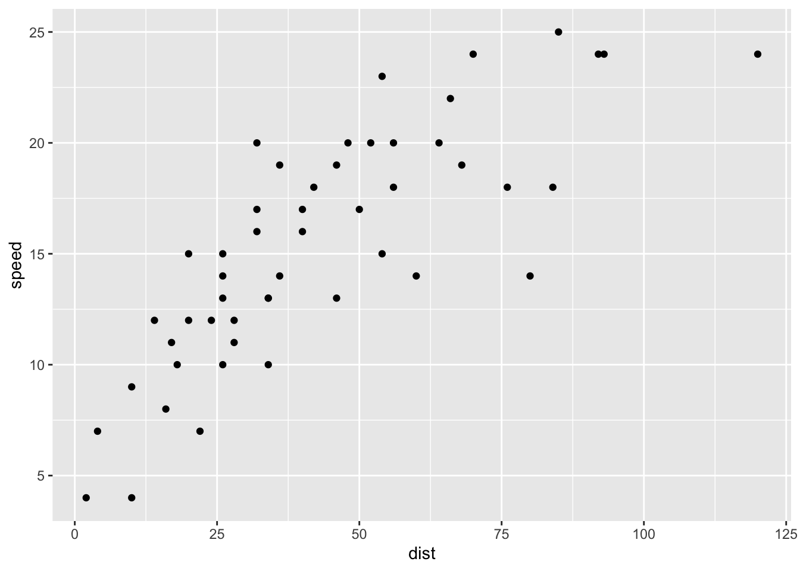

## Quarto



Quarto enables you to weave together content and executable code into a finished presentation. To learn more about Quarto presentations see <https://quarto.org/docs/presentations/>.

## Bullets

When you click the **Render** button a document will be generated that includes:

-   Content authored with markdown
-   Output from executable code

## Code

When you click the **Render** button a presentation will be generated that includes both content and the output of embedded code. You can embed code like this:

@fig-test


```{.r .cell-code}
library(ggplot2)
library(ofce)
graph <- list(a = ggplot(cars)+geom_point(aes(dist, speed)), b = ggplot(cars)+geom_point(aes(dist, speed)))

tabsetize(graph, girafy = FALSE, pdf = "one")
```

:::: {#fig-test} 

::: {.panel-tabset} 

### a


::: {.cell}

```{.r .cell-code}
plot 
```

::: {.cell-output-display}
{width=672}
:::
:::


### b


::: {.cell}

```{.r .cell-code}
plot 
```

::: {.cell-output-display}
{width=672}
:::
:::


:::


::::
