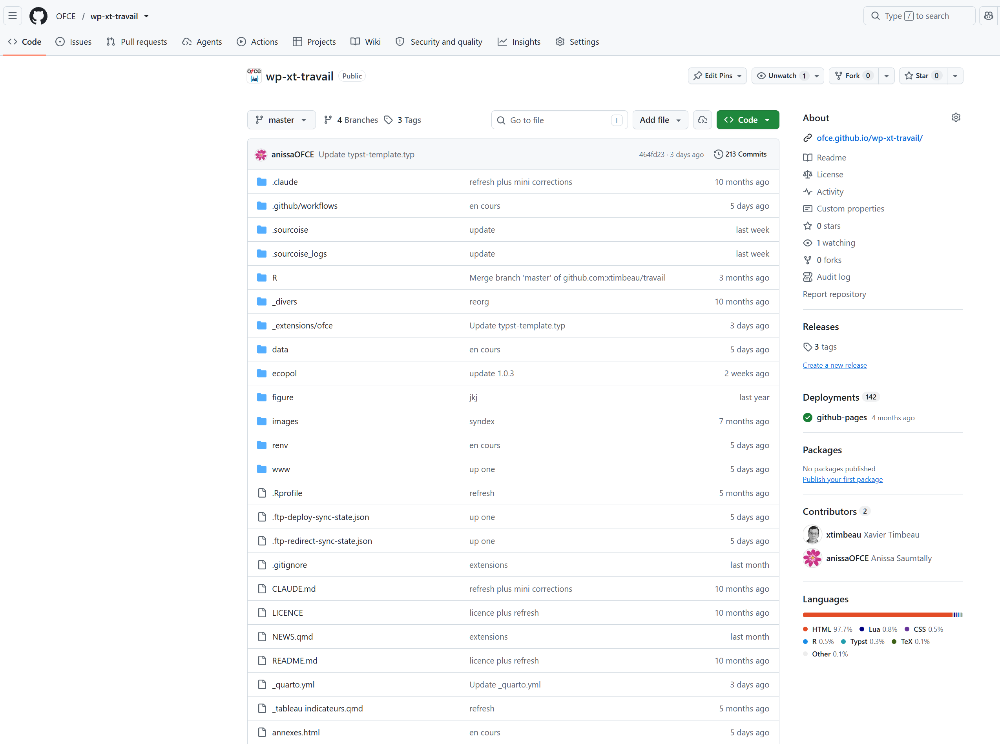
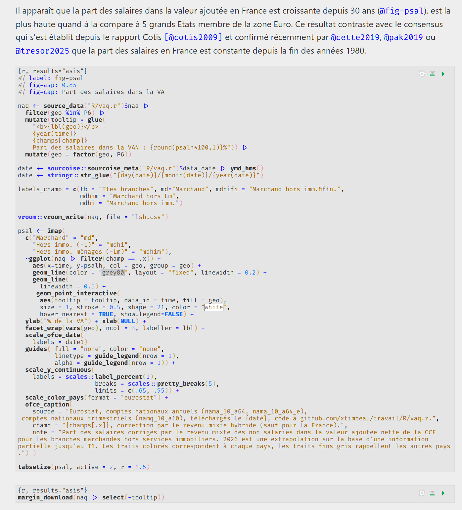
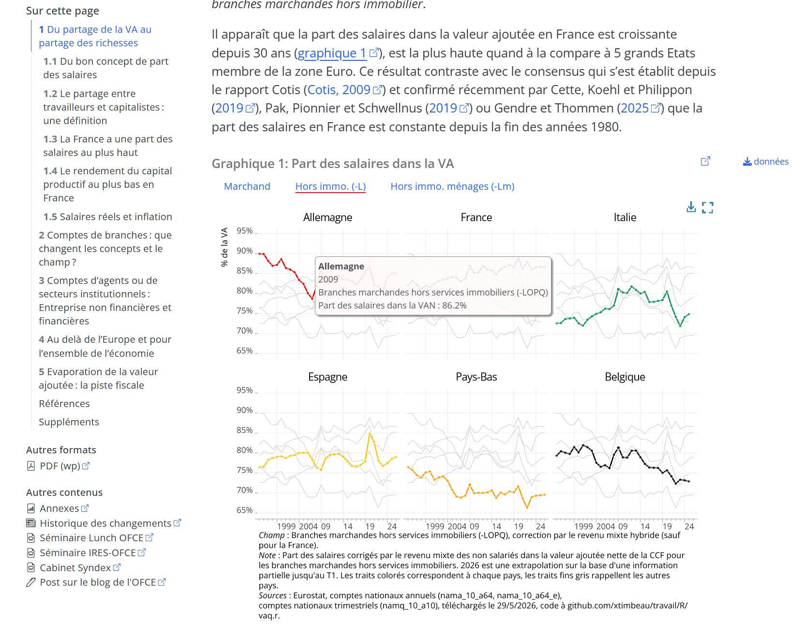
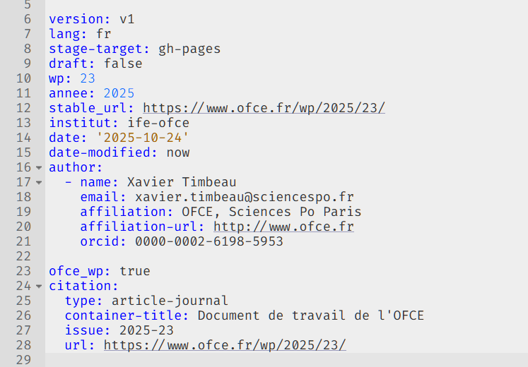
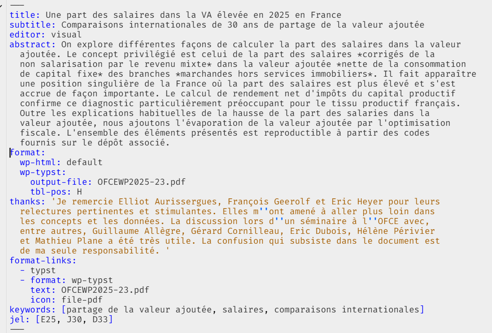
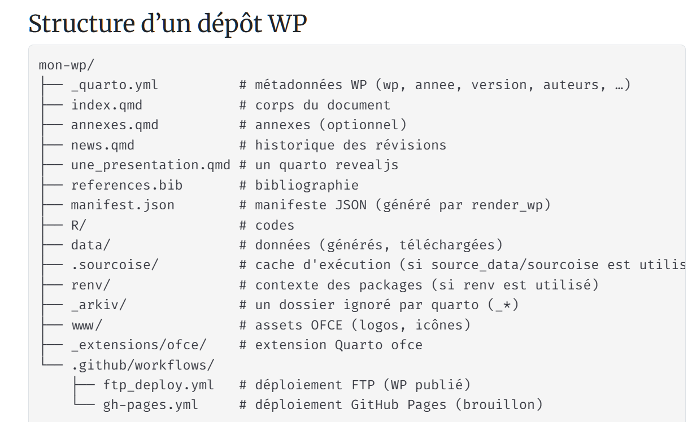
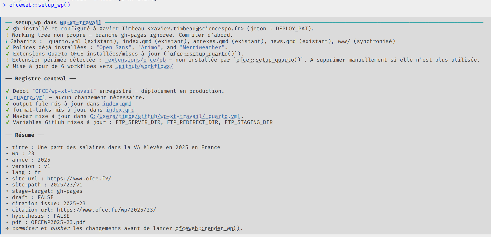
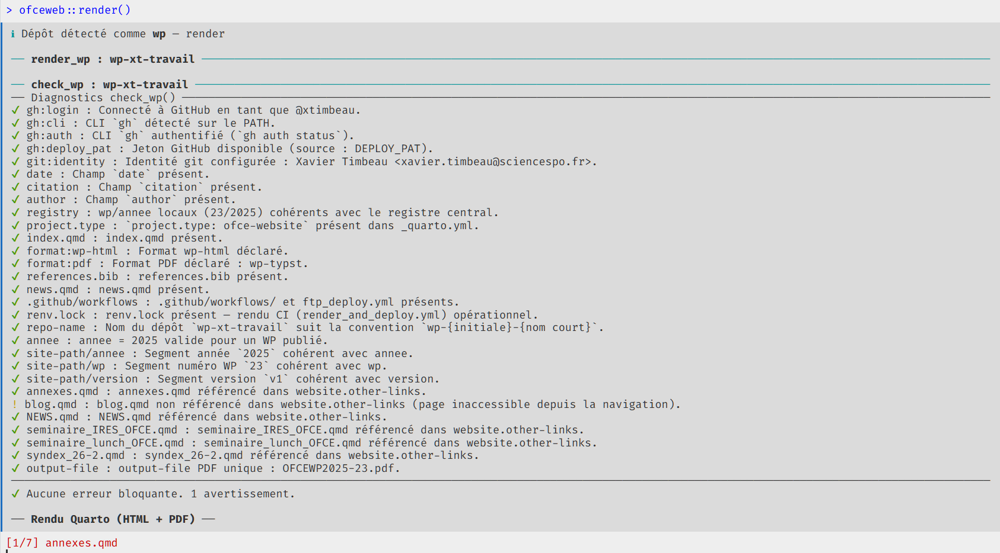
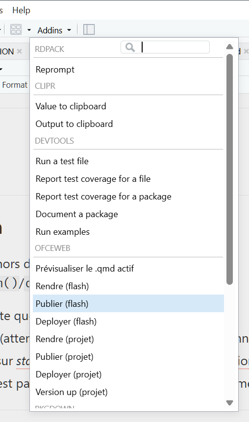

## Objectifs

<br>

- présentation de la chaîne d'outils et du processus de travail (workflow)
  - pour les documents de travail
  - les policy brief
  - les ecograph

<br>

- Ce qui ne sera pas traité:
  - l'utilisation des outils RStudio/quarto/git/github ni leur installation
  - la rédaction d'un document quarto (code+texte, document structuré)

## Principe 1: un travail un dépôt

::::: columns
::: {.column width="50%"}
<br>

- Un document de travail  un dépôt git

- Un dépôt est un "dossier en ligne", partagé, versionné, protégé

- Il est sur github.com (cloud), et en local (autant de fois que nécessaire), que l'on modifie

- Il est "autonome", i.e. tout ce qui est nécessaire se trouve dans le dossier, les chemins sont relatifs. C'est la base de la réplicabilité, puisque github.com permet de le partagé (en lecture) à tous le monde

- On peut avoir des architectures plus complexes (données sur un serveur/un disque partagé)
:::

::: {.column width="50%"}
[](https://github.com/OFCE/wp-xt-travail)
:::
:::::

## Principe 2: un travail c'est des données, des traitements, des graphiques, des codes; du texte {.smaller}

::::: columns
::: {.column width="50%"}
<br>

- Source unique: on ne copie colle pas (les données, les graphiques, les tableaux)
  - la source unique garantie la cohérence des documents,
  - elle permet la lisibilité de la production (la façon de produire ce graphique est explicite), un relecteur peut suivre la chaîne qui y conduit
  - parce que la chaîne est complète (du téléchargement aux traitements jusqu'à la mise en page du graphique) le travail est reproductible (ou réplicable)
  - C'est utile pour les autres mais aussi pour soi même
- Comme on peut le voir sur ce bot de code, des outils sont mis à votre disposition
  - package `{ofce}` et l'application d'une charte graphique

  - des outils pour l'interactivité et les "infobulles", les tabsets

  - `{sourcoise}` (`source_data`) pour faciliter l'éxécution du code et la mise en cache des données

  - quelques régles comme la source du graphique, les données téléchargeables.
:::

::: {.column width="50%"}

:::
:::::

## Principe 2: le rendu

[{fig-align="center" width="794"}](https://www.ofce.fr/wp/2025/23/)

<br>

## Principe 3: les métadonnées

::::: columns
::: {.column width="50%"}
<br>

- Un document (un travail) ce sont aussi des métadonnées qui permettent de ranger et retrouver le document

  - une/un/des autrice/auteur/auteurs -- si possible documentés (affiliations, mail, orcid)
  - un titre, un sous titre
  - institut !
  - des mots clefs
  - des catégories
  - des codes JEL
  - un numéro, un doi, une url stable

- Plus d'autres métadonnées techniques

- Ce sont les yaml, une partie particulière d'un document quarto (marquée par `---` en haut et en bas ou dans un quarto.yml)
:::

::: {.column width="50%"}
{width="402"} {width="413"}
:::
:::::

## La structure d'un dépôt

{width="1024"}

## Comment faire ? {.smaller}

::::: columns
::: {.column width="50%"}
<br>

1.  On crée un dépôt, on y met son travail (.qmd, codes, données, données issues d'analyses (e.g. CASD, Stata, Excel)). On fait en sorte que les graphiques soit en ggplot, les tableaux en gt, on cherche à ce que ce soit reproductible.

2.  On lance `ofceweb::setup_wp()` qui s'occupe de tout (et n'est pas destructif, donc on peut le lancer autant de fois que l'on veut)

3.  On remplit les métadonnées

<br>

<br>

4.  On vérifie que ça fonctionne `ofceweb::render()`, on corrige les erreurs, on demande de l'aide éventuellement.
:::

::: {.column width="50%"}
{width="1241"}


:::
:::::

## Publication (1/3)

<br>

**1 Cas 1**: le document de travail n'est pas encore validé, il est en *staging*

La commande `ofceweb::publish()` lance la publication

- Si le dépôt est dans l'organisation **OFCE**, le document est publié sur le [*staging* de l'OFCE](https://staging.ofce.fr/wp-hp-parenthood). Il est privé, protégé par un mot de passe, on fait des commentaires par hypothesis. L'autrice peut publier autant de fois que voulu, le versionner (staging.ofce.fr/wp-hp-parenthood/**v1**).

- Si le dépôt n'est pas dasn l'organisation **OFCE**, il ets publié sur `gh-pages`. Il peut être crypté mais ne peut pas être versionné.

## Publication (2/3)

<br>

**2 Cas 2** : le document est validé, il est en *production*

- Le dépôt est obligatoirement dans l'organisation **OFCE**. Les admins ont accès (écriture) au dépôt.

- Sauf exception, l'auteur peut publier directement. Il peut donc modifier/mettre à jour. Les admins peuvent limiter cette possibilité.

- Le document n'est pas crypté, les commentaires sont fermés, l'url est stable, le document est référencé

Pour passer en production: soit on demande à un admin, soit on lance `ofceweb::registry_request()`. La validation scientifique et technique est faite sur la base du document *stagé*.

## Publication (3/3)

<br>

En résumé

```{{r}}
ofceweb::setup_wp()
ofceweb::render()
ofceweb::check()
ofceweb::publish()
ofceweb::registry_request()

```

## Publication Flash

On peut publier un .qmd, hors de toute architecture par `ofceweb::render_flash()`/`ofceweb::publish_flash()`

- fonctionne sur n,'importe quel qmd
- fait un rendu à minima (attention les liens peuvent ne pas fonctionner)
- la publication est faite sur *staging*, cryptée, url unique, pas de versionage (sauf manuel)
- Attention, le staging n'est pas persistant (i.e. il est effacé régulièrement)

::::: columns
::: {.column width="50%"}
<br>

<br>

```{{r}}
ofceweb::render_flash()
ofceweb::publish_flash()

```
:::

::: {.column width="50%"}
{fig-align="center" width="177"}
:::
:::::

## Merci de votre attention!

Ce qu'il reste à faire :

- Définir, décliner (ife/ ife\|ofce / ife\|cepii ) déployer la charte graphique. La mise en page est séparée du texte

- Développer les sites autour de l'architecture des données, développer les outils

- Porter `ofce`/`ofceweb` (ou non) en `ife`/`ifeweb`
