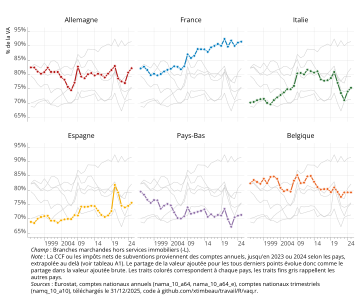

::: {.content-visible when-format="html"}
## Longeur {.appendix .unlisted .unnumbered}

{{wordcount}} mots
:::

## Du partage de la VA au partage des richesses

L'analyse du partage de la valeur ajoutée (@fig-psal) est au cœur des débats sur la redistribution des richesses (voir notamment @hurlin1996, @timbeau2002, @cotis2009, @husson2010, @askenazy2012, @piton2019, @pak2019, @cette2019, @timbeau2025, @tresor2025). Un indicateur souvent retenu est celui de la part des salaires dans la valeur ajoutée. Nous discutons ici de la construction de cet indicateur et de sa comparabilité entre pays.

:::: {#fig-psal} 

::: {.cell}
::: {.cell-output-display}
{#fig-psal-1 fig-pos='htb' width=100%}
:::
:::

Part des salaires dans la VA nette

::::

### Du bon concept de part des salaires

Trois points sont importants pour disposer du bon concept (voir @reis2022 pour une discussion et une revue de littérature sur ce point) :

-   **Corriger des non salariés et leur imputer une masse salariale**. La correction habituelle consiste à affecter aux non salariés le même salaire que les salariés (généralement de la même branche) ; c'est ainsi que traitent la question @cette2019 et @tresor2025. Nous procédons à cette correction (appelée *correction par les effectifs*) aux 21 branches de la NACE rev. 2 niveau 1. Nous proposons une alternative en utilisant la mesure du revenu mixte (dite *correction par le revenu mixte*), parce que l'affectation d'un salarie égal aux non salariés et aux salariés par branches conduit à imputer un équivalent masse salariale supérieur au revenu mixte des non salariés\[\^1\]. En France, le revenu mixte (des non-salariés) est passé de 30% de la masse salariale (autant pour le ratio des effectifs) au début des années 1970 à un peu moins de 10% (presque 15% pour les effectifs) en 2024. Malheureusement, le revenu mixte par branche n'est pas diffusé systématiquement par les Etats membres de l'UE. Ces corrections modifient significativement la part des salaires dans la valeur ajoutée, suivant la méthode, parce que non seulement la part des non salariés et de leur revenu mixte varie dans le temps, de façon différente par un effet de structure (moins d'agriculteurs) et de nature (les non salariés sont moins rémunérés aujourd'hui), de façon différente par pays (@fig-psal et voir les annexes D et G consacrées à ce point).

Le concept que nous privilégions est ainsi défini comme suit (où, pour chaque branche $D1_b$ est la masse salariale chargée, $B1G_b$ la valeur ajoutée brute, $P51C_b$ la $CCF_b$, les trois notions en euros aux prix courants et $ns_b$ et $sal_b$ les effectifs en personne ou le revenu mixte par branche)[^1] et $D29-D39$ les impôts de production nets de subventions :

[^1]: @cette2019 utilisent une définition plus large des branches non marchande en incluant les branches R, T et U.

$$
s_{net, n.s., -LOPQ}  = \frac{\sum_{b\in{TT-LOPQ}}{D1_b*(1+ns_b/sal_b)}}{\sum_{b\in{TT-LOPQ}}{B1G_b - P51C_b - (D29_b-D39_b)}}
$$

> Une citation : La part des salaires dans la valeur ajoutée nette est croissante en France (@fig-psal) (de 10 points de 1998 à 2025), comme en Espagne (de 9 points). Elle atteint en France le niveau le plus élevé des pays sélectionnés (correction des non salariés par les effectifs), pour autant que l'on puisse comparer entre pays. Ce résultat contraste avec les évaluations récentes de @cette2019 et @tresor2025 qui concluent à une stabilité de la part des salaires dans la valeur ajoutée autour de ce qu'ils supposent être une valeur d'équilibre.

Théoriquement[^2], l'évolution de part des salaires dans la valeur ajoutée dépend de la fonction de production agrégée (ce qui suppose qu'elle existe). Si l'élasticité de substitution entre le capital et la travail est unitaire alors on s'attend à ce que le partage soit indépendant du prix relatif du travail et du capital. La part des salaires est alors uniquement déterminée par la forme de la fonction de production et devrait converger dans tous les pays vers une valeur semblable, par diffusion de la technologie. Une structure de l'économie par branche différente peut cependant se traduire par des parts différentes d'un pays à l'autre.

[^2]: @cette2019 propose une modélisation simple des principaux déterminants du partage de la valeur ajoutée sur la base d'une fonction de production. @reis2022 étend l'analyse en équilibre néokeynéisien.

::: {#tip-e1 .callout-tip}
## les encadrés doivent fonctionner

L'élasticité estimée généralement, au moins à moyen terme, est sensiblement inférieure à 1, en tout cas sur données macroéconomique. Cela implique qu'une hausse du prix du travail relativement par au capital se traduit par une hausse de la part du travail dans la valeur ajoutée – la réciproque étant bien entendu vraie si c'est le capital qui est relativement plus cher. Cela peut conduire à des variations plus persistantes de la part des salaires dans la valeur ajoutée (ce qu'on appelle le *wage push*), mais ces variations doivent reproduire celles des prix relatifs.

La part des salaires dans la valeur ajoutée est la plus basse aux Pays-Bas et est sur une pente décroissante depuis plus de 20 ans, alors qu'elle semble stable en Belgique et en Allemagne. L’Italie affiche une variabilité temporelle importante, avec un pic de la part des salaires dans la valeur ajoutée en 2013, puis une franche décroissance (de plus de 13 points) interrompue dans la période récente suite à la période d'inflation et la forte relance budgétaire.

En France, la hausse est franche après la crise financière de 2008, suivant une période de grande stabilité de 1995 à 2007. Cette hausse peut découler d'un effet de structure sectorielle, mais le @fig-salaires indique une autre singularité française. Contrairement à de nombreux pays, les salaires réels sont restés sur une pente croissante, interrompue par la phase d'inflation à partir de la fin de l'année 2021, alors que dans les 5 autres pays, 2008 marque une cassure dans la progression de salaires réels.

Depuis 2018, en France, la part des salaires est stabilisée, à un haut niveau (@fig-psal). L'inflation et le retard d'ajustement des salaires sur l'inflation explique probablement cette trajectoire. On observe des mouvements comparables dans d'autres pays, bien que plus violent en Allemagne ou en Italie par exemple.

Au début des années 2000, deux pays se distinguaient des autres (l'Espagne et l'Italie) par une part des salaires plus faibles. L'écart avec l'Allemagne atteignait alors plus de 15 points. En généralisant l'approche aux pays de l'Union Européenne, on peut en partie confirmer cette hypothèse (@fig-psal). Les pays qui ont connu un développement rapide, et donc des niveaux d'investissement élevés, on eu des parts des salaires basses (La Bulgarie, la Tchéquie, la Grèce par exemple). Mais ce n'est pas une observation systématique : certains pays moins développés ont eu par le passé une part très élevée des salaires dans la valeur ajouté, témoignant peut être de modes de formation des salaires et d'inflation particulier et hérités du passé. Cependant, comme le suggèrent la position singulière de quelques petits pays, parmi lesquels l'Irlande, le Luxembourg, Malte, Chypre ou les Pays-Bas dans une certaine mesure, c'est peut être du côté du déplacement de la base imposable des profits (optimisation fiscale), des prix de transferts et d'une position très particulière dans la chaîne de valeur qu'il faut aller chercher l'explication de très faibles parts des salaires dans la valeur ajoutée.
:::

### Impact du changement de structure de l'économie

On peut décomposer le changement de la part des salaires dans la valeur ajoutée en un effet de structure en branche et un effet de changement de la part des salaires dans la valeur ajoutée dans chaque branche. Formellement la décomposition retenue s'écrit (où $w_{b,t}$ est la part de VAN de la branche $b$ dans la valeur ajoutée nette de l'ensemble des branches considérées et $s_{b,t}$ la part des salaires dans la branche $b$) :

$$
\begin{aligned}
s_t - \sum w_{b,1995} \times s_{b,1995} = \sum w_{b,1995} \times (s_{b,t}-s_{b,1995}) \\ + \sum (w_{b,t} - w_{b,1995}) \times s_{b,t}  
\end{aligned}
$$

L'année 1995 est l'année de référence et le premier terme (de droite) s'interprète comme la part des salaires qui prévaudrait s'il n'y avait pas eu de changement de structure. Le @fig-psal représente ce terme ainsi que la part agrégée des salaires ($s_{t}$). L'effet de la structure par branche de l'économie (ici marchande hors services immobiliers produits par les ménages) est assez marginale. Les variations de la part des salaires sont bien celle des parts des salaires dans chaque secteur.

Il existe quelques exceptions à cette règle générale. A structure de branche inchangée, avec comme année de référence 1995, la part des salaires serait plus basse de 3,5 points de VA pour les Pays-Bas en 2025. En Allemagne ou en Belgique, le changement de structure des branches explique un petit peu de l'évolution à la hausse.

En revanche, la part des salaires serait légèrement supérieure en Italie à structure inchangée. Le pic de valeur ajoutée en 2013 est lié entièrement à la structure par branche, ce qui laisse supposer une rupture de série dans les comptes de branche.

::: {style="text-align: right;"}

:::

## Références {.unnumbered}

::: {#refs}
:::

:::: {.content-visible when-format="html"}
### Annexe A : derniers points connus {.unnumbered}

::: {#apptbl-data_trim}

::: {.cell}
::: {.cell-output-display}
\begin{table}
\fontsize{8.0pt}{10.0pt}\selectfont
\begin{tabular*}{\linewidth}{@{\extracolsep{\fill}}>{\raggedright\arraybackslash}p{\dimexpr 22.50pt -2\tabcolsep-1.5\arrayrulewidth}>{\raggedright\arraybackslash}p{\dimexpr 60.00pt -2\tabcolsep-1.5\arrayrulewidth}>{\centering\arraybackslash}p{\dimexpr 48.75pt -2\tabcolsep-1.5\arrayrulewidth}>{\centering\arraybackslash}p{\dimexpr 48.75pt -2\tabcolsep-1.5\arrayrulewidth}>{\centering\arraybackslash}p{\dimexpr 48.75pt -2\tabcolsep-1.5\arrayrulewidth}>{\centering\arraybackslash}p{\dimexpr 48.75pt -2\tabcolsep-1.5\arrayrulewidth}>{\centering\arraybackslash}p{\dimexpr 48.75pt -2\tabcolsep-1.5\arrayrulewidth}>{\centering\arraybackslash}p{\dimexpr 48.75pt -2\tabcolsep-1.5\arrayrulewidth}>{\centering\arraybackslash}p{\dimexpr 48.75pt -2\tabcolsep-1.5\arrayrulewidth}>{\centering\arraybackslash}p{\dimexpr 48.75pt -2\tabcolsep-1.5\arrayrulewidth}>{\centering\arraybackslash}p{\dimexpr 48.75pt -2\tabcolsep-1.5\arrayrulewidth}>{\centering\arraybackslash}p{\dimexpr 48.75pt -2\tabcolsep-1.5\arrayrulewidth}}
\toprule
 &  & \multicolumn{2}{>{\centering\arraybackslash}m{\dimexpr 97.50pt -2\tabcolsep-1.5\arrayrulewidth}}{\shortstack[l]{\textbf{B1G, D1} \\trim., niveau 1 \\namq\_10\_a10}} & \multicolumn{2}{>{\centering\arraybackslash}m{\dimexpr 97.50pt -2\tabcolsep-1.5\arrayrulewidth}}{\shortstack[l]{\textbf{SAL, NSAL} \\an., niveau 2 \\nama\_10\_a64\_e}} & \multicolumn{2}{>{\centering\arraybackslash}m{\dimexpr 97.50pt -2\tabcolsep-1.5\arrayrulewidth}}{\shortstack[l]{\textbf{P51C, D29x39, D51} \\an., niveau 1 \\nama\_10\_a64}} & \multicolumn{2}{>{\centering\arraybackslash}m{\dimexpr 97.50pt -2\tabcolsep-1.5\arrayrulewidth}}{\shortstack[l]{\textbf{L68A} \\an., niveau 2 \\nama\_10\_a64}} & \multicolumn{2}{>{\centering\arraybackslash}m{\dimexpr 97.50pt -2\tabcolsep-1.5\arrayrulewidth}}{\shortstack[l]{\textbf{N11N} \\an., niveau 2 \\nama\_10\_nfa\_st}} \\ 
\cmidrule(lr){3-4} \cmidrule(lr){5-6} \cmidrule(lr){7-8} \cmidrule(lr){9-10} \cmidrule(lr){11-12}
 &  & de & à & de & à & de & à & de & à & de & à \\ 
\midrule\addlinespace[2.5pt]
DE & Allemagne & 1991T1 & 2025T2 & 1995 & 2024 & 1995 & 2024 & 1995 & 2024 & 1995 & 2023 \\ 
FR & France & 1980T1 & 2025T2 & 1978 & 2024 & 1978 & 2024 & 1978 & 2023 & 1978 & 2024 \\ 
IT & Italie & 1995T1 & 2025T2 & 1995 & 2024 & 1995 & 2024 & 1995 & 2024 & 1995 & 2024 \\ 
ES & Espagne & 1995T1 & 2025T3 & 1995 & 2024 & 1995 & 2024 & 1995 & 2023 & 1995 & 2023 \\ 
PL & Pologne & 1995T1 & 2025T2 & 1995 & 2024 & 1995 & 2024 & 1995 & 2023 & 2000 & 2022 \\ 
RO & Roumanie & 1995T1 & 2025T2 & 1995 & 2024 & 1995 & 2024 & 1995 & 2024 & 1995 & 2022 \\ 
NL & Pays-Bas & 1995T1 & 2025T2 & 1995 & 2024 & 1995 & 2024 & 1995 & 2024 & 1995 & 2023 \\ 
BE & Belgique & 1995T1 & 2025T2 & 1995 & 2024 & 1995 & 2024 & 1995 & 2023 & 1995 & 2024 \\ 
CZ & Tchéquie & 1995T1 & 2025T2 & 1995 & 2024 & 1995 & 2024 & 1995 & 2024 & 1995 & 2024 \\ 
PT & Portugal & 1995T1 & 2025T2 & 1995 & 2024 & 1995 & 2024 & 1995 & 2023 & 2000 & 2022 \\ 
SE & Suède & 1993T1 & 2025T2 & 1993 & 2024 & 1993 & 2023 & 1993 & 2023 & 1993 & 2022 \\ 
GR & Grèce & 1995T1 & 2025T2 & 1995 & 2024 & 1995 & 2024 & 1995 & 2024 & 1995 & 2022 \\ 
HU & Hongrie & 1995T1 & 2025T2 & 1995 & 2024 & 1995 & 2024 & 1995 & 2024 & 1995 & 2023 \\ 
AT & Autriche & 1995T1 & 2025T2 & 1995 & 2024 & 1995 & 2024 & 1995 & 2024 & 1995 & 2024 \\ 
BG & Bulgarie & 1995T1 & 2025T2 & 1995 & 2024 & 1995 & 2024 & 1995 & 2024 & 2000 & 2022 \\ 
DK & Danemark & 1995T1 & 2025T2 & 1975 & 2024 & 1975 & 2024 & 1975 & 2024 & 1975 & 2024 \\ 
FI & Finlande & 1990T1 & 2025T2 & 1980 & 2024 & 1980 & 2024 & 1980 & 2024 & 1980 & 2024 \\ 
SK & Slovaquie & 1995T1 & 2025T2 & 1995 & 2024 & 1995 & 2024 & 1995 & 2024 & 2000 & 2023 \\ 
IE & Irlande & 1995T1 & 2025T2 & 1995 & 2024 & 1995 & 2024 & 1995 & 2024 & 1995 & 2023 \\ 
HR & Croatie & 1995T1 & 2025T2 & 1995 & 2024 & 1995 & 2024 & 1995 & 2023 & 1995 & 2022 \\ 
LT & Lituanie & 1995T1 & 2025T2 & 1995 & 2024 & 1995 & 2024 & 1995 & 2024 & 1995 & 2022 \\ 
SI & Slovénie & 1995T1 & 2025T2 & 1995 & 2024 & 1995 & 2024 & 1995 & 2024 & 1995 & 2023 \\ 
LV & Lettonie & 1995T1 & 2025T2 & 1995 & 2024 & 1995 & 2024 & 1995 & 2023 & 1995 & 2022 \\ 
EE & Estonie & 1995T1 & 2025T2 & 2000 & 2024 & 1995 & 2024 & 1995 & 2024 & 2000 & 2022 \\ 
CY & Chypre & 1995T1 & 2025T2 & 1995 & 2024 & 1995 & 2024 & 1995 & 2023 & 1995 & 2022 \\ 
LU & Luxembourg & 1995T1 & 2025T2 & 1995 & 2024 & 1995 & 2024 & 1995 & 2024 & 1995 & 2023 \\ 
MT & Malte & 1995T1 & 2025T2 & 1995 & 2024 & 1995 & 2024 & 1995 & 2024 & 2000 & 2023 \\ 
\bottomrule
\end{tabular*}
\begin{minipage}{\linewidth}
\emph{Note} : données téléchargées sur le site d'Eurostat (package eurostat v4.0.0) le 1/1/225, telles que publiées par Eurostat. Les instituts nationaux peuvent mettre à dispositon plus de données non (encore ?) prises en compte par Eurostat. Le niveau 1 compte 21 branches dont 19 marchandes. Le niveau 2 compte jusqu'à 99 branches, 47 sont utilisées pour les comptes de stock de capital productif.\\
\end{minipage}
\end{table}

:::
:::

Premiers et derniers points connus par pays et par variables
:::
::::

::: {.content-visible when-format="pdf"}
## Suppléments {.unnumbered}

6 annexes sont accessibles en ligne à l'adresse <https://xtimbeau.github.io/travail/> :

-   annexe A : Domaine des données,
-   annexe B : CCF,
-   annexe C : Comparaisons entre pays,
-   annexe D : Rémunération des non salariés,
-   annexe E : CN2020 et CN2014 pour la France,
-   annexe F : Rendement du capital productif en France de 1978 à 2024
:::
